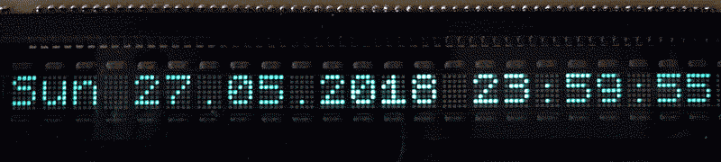
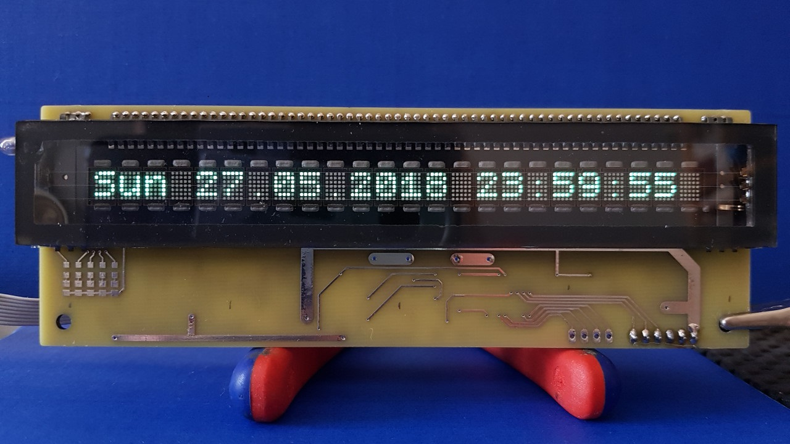
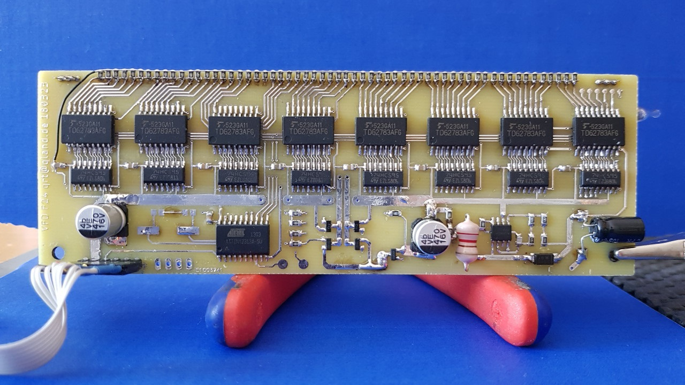
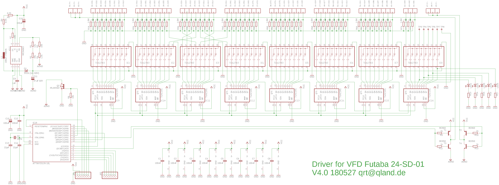
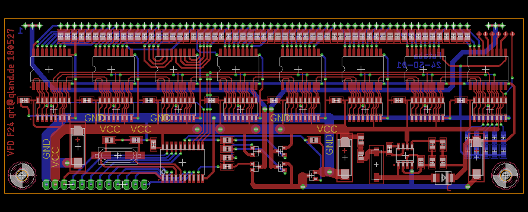

# Driver for Futaba-24-SD-01 VFDisplay
Schematic, PCB, Driver, Example

## Scroll Action (driver based)

## Code
[-> source](source)

**ATTINY2313 (Atmel) AVR assembler based driver**  
\- 127 ASCII characters (with descender)

\- 8 user defined custom characters  
\- optional character scroll  
\- SPI slave interface  
\- brightness control  
\- filament voltage control  
\- display power off

**Arduino examples**  
\- scrolling time display  
\- custom chars

## Display
Front View (V3)  
24 character, 5 x 7 dots each, bright greenish blue  
left below display unused LED pads

Back View (V3)  
8 voltage drivers, 8 shift registers, ATTINY2313, filament supply bridge, power MOSFET, MC34063 stepup  

## Schematic and PCB
Schematic (V4)  
MC34063 stepup, 8 voltage drivers, power MOSFET, 8 shift registers, ATTINY2313, filament supply bridge

PCB (V4)  

## Assemble
I used [Avra 1.3.0 assembler](https://sourceforge.net/projects/avra/files/) and adapted the *tn2313def.inc* of AtmelStudio (commented out pragmas).  
Alternatively you can adapt the point directives (.define) of my assembler source to make it work with AtmelStudio assembler.

## History
__V3__  
initial version  
__V4__  
schematic and PCB corrections  
__V5__  
software update, hex-files, assembler hint

## Links
http://www.futaba.com/products/display_modules/lcd_emulator/downloads/pdfs/LCD_Emulators.pdf  
https://www.microchip.com/wwwproducts/en/ATtiny2313  
http://www.ti.com/lit/ds/symlink/sn74hc595.pdf  
http://www.tosharp.cn/ckfinder/userfiles/files/DATASHEET/IC/TD62783AFG(5%2CS%2CEL).pdf  
http://www.ti.com/lit/an/slva252b/slva252b.pdf  
https://www.noritake-elec.com/technology/general-technical-information/vfd-operation  
https://threeneurons.wordpress.com/vfd-stuff/
